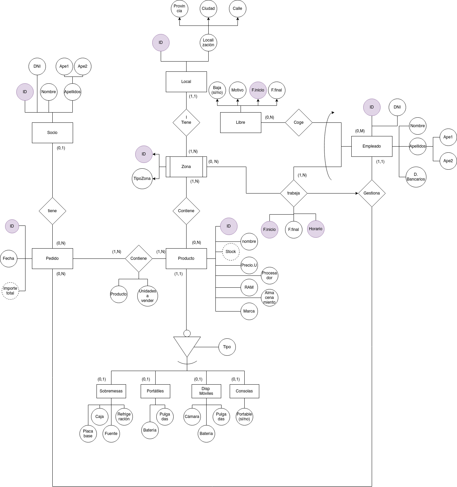
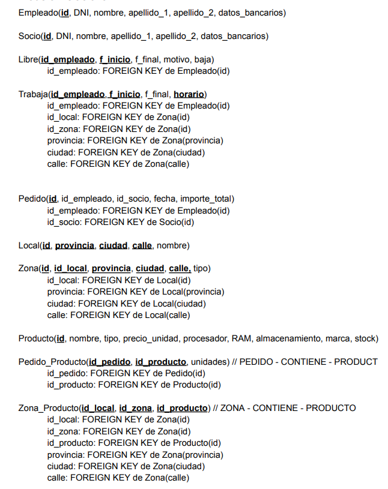
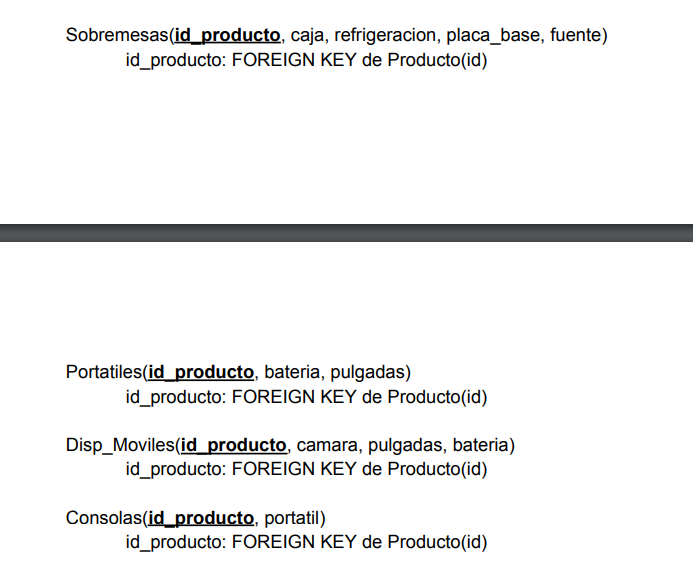

# Proyecto Final de ADBD

## Descripción
Este proyecto consiste en una aplicación para la gestión de una tienda, desarrollada como parte de la asignatura Administración de Bases de Datos. La aplicación utiliza Flask para la creación de una API que interactúa con una base de datos PostgreSQL. A continuación, se detalla la estructura del proyecto, el diseño de la base de datos, y las funcionalidades implementadas.

---

## Diagramas

### Diagrama Entidad-Relación
El diagrama entidad-relación (ER) proporciona una visión general del diseño lógico de la base de datos, mostrando las entidades principales y sus relaciones.



### Diagrama Relacional
El diagrama relacional muestra la estructura física de la base de datos, incluyendo las tablas, columnas y sus relaciones.





---

## Estructura del Proyecto

```plaintext
.
├── ApiProyecto
│   └── store
│       ├── docker-compose.yml
│       ├── Dockerfile
│       ├── flask_app
│       │   ├── app.py             # Archivo principal para inicializar la aplicación Flask
│       │   ├── db.py              # Configuración de la conexión con la base de datos
│       │   ├── routes             # Rutas para manejar diferentes recursos de la API
│       │   │   ├── empleado.py
│       │   │   ├── empleado_pedido.py
│       │   │   ├── libre.py
│       │   │   ├── local.py
│       │   │   ├── pedido.py
│       │   │   ├── producto.py
│       │   │   ├── socio.py
│       │   │   ├── trabaja.py
│       │   │   ├── zona.py
│       │   │   └── zona_producto.py
│       └── postgres_data          # Datos persistentes para PostgreSQL
├── diagramas                     # Diagramas del proyecto
│   ├── ER.png                    # Diagrama Entidad-Relación
│   └── Relacional.png            # Diagrama Relacional
├── README.md                     # Archivo de documentación
├── scripts                       # Scripts SQL para pruebas y manejo de datos
│   ├── bad_insert.sql            # Pruebas de inserciones erróneas
│   ├── bad_update.sql            # Pruebas de actualizaciones erróneas
│   ├── empty.sql                 # Script para vaciar la base de datos
│   ├── erase.sql                 # Script para eliminar datos
│   ├── good_bad_delete.sql       # Pruebas de eliminaciones correctas y erróneas
│   ├── insert.sql                # Inserciones iniciales
│   ├── pruebas_informe.sql       # Consultas usadas en el informe
│   └── update.sql                # Actualizaciones de datos
└── store.sql                     # Script de creación de la base de datos
```

---

## Tecnologías Utilizadas

- **Python**: Desarrollo de la API con Flask.
- **PostgreSQL**: Sistema de gestión de bases de datos.
- **SQL**: Lenguaje para la creación y manipulación de la base de datos.

---

## Instalación y Configuración

### Prerrequisitos
- PostgreSQL instalado en el sistema.

### Pasos para ejecutar el proyecto
1. Clona este repositorio:
   ```bash
   git clone <URL_DEL_REPOSITORIO>
   ```
2. Navega hacia los scripts:
   ```bash
   cd scripts
   ```
3. Construye la base de datos:
   ```bash
   psql -d store -U usuario -f store.sql
   ```
4. Puebla la base de datos con datos iniciales:
   ```bash
   store=# \i scripts/insert.sql
   ```
5. Navega hacia la carpeta de la API:
   ```bash
   cd ApiProyecto/store
   ```
6. Ejecuta la api con flask:
   ```bash
   flask --app app.py run
   ```
7. Accede a la API en `http://localhost:5000`.

Cabe destacar que para la ejecución de la API se debe tener instalado Flask y psycopg2 en el entorno de Python. Para instalarlos, se puede utilizar pip:
```bash
pip install Flask psycopg2
```

---

## Funcionalidades Implementadas

### API Endpoints
La API incluye las siguientes rutas principales:
- **Empleado**: Gestión de empleados.
- **Pedido**: Creación, actualización y eliminación de pedidos.
- **Producto**: Gestión del inventario.
- **Local**: Información de los locales.
- **Zona**: Gestión de zonas y asignación de productos.

Consulta la documentación detallada de cada endpoint en los archivos correspondientes dentro del directorio `routes`, o la raiz de la API en `http://localhost:5000` donde se muestra una tabla con los endpoints disponibles y una breve descripción de cada uno.

---

## Scripts SQL

### Scripts Principales
- `insert.sql`: Contiene datos iniciales para poblar la base de datos.
- `update.sql`: Actualizaciones de ejemplo para pruebas.
- `erase.sql`: Elimina datos específicos de la base de datos.
- `empty.sql`: Vacía por completo la base de datos.

### Pruebas
- `bad_insert.sql`: Casos de prueba para inserciones fallidas.
- `good_bad_delete.sql`: Casos de prueba para eliminaciones correctas e incorrectas.
- `pruebas_informe.sql`: Consultas usadas en el análisis e informe final.


## Autores
- **[Sergio Perera Márquez]**
- **[Brayan José Pérez Ramos]**

